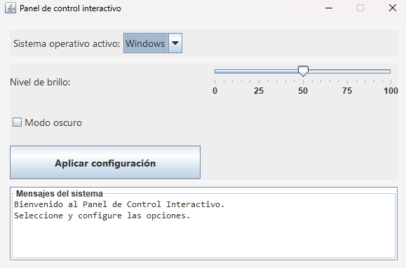
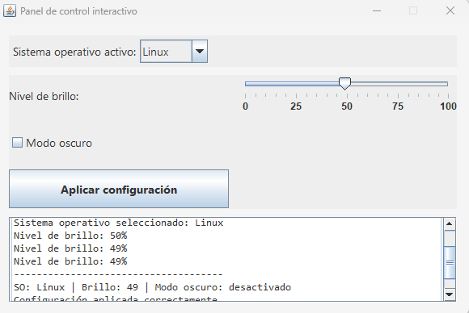
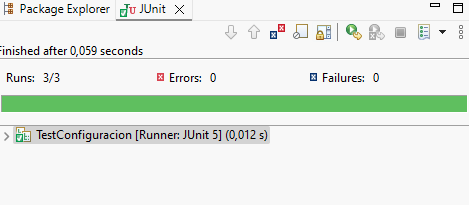
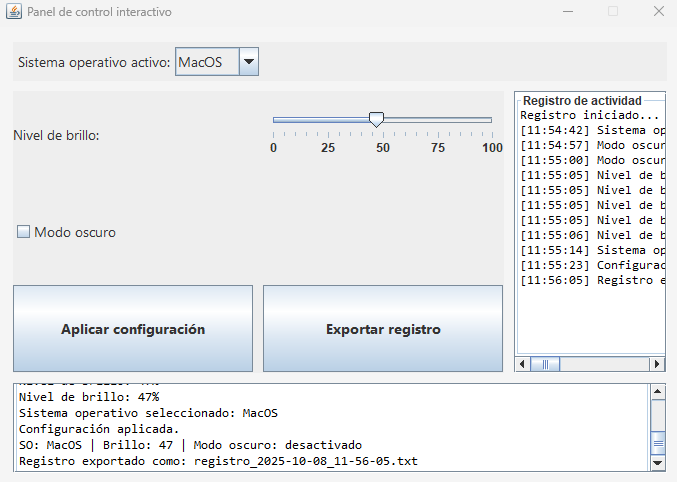
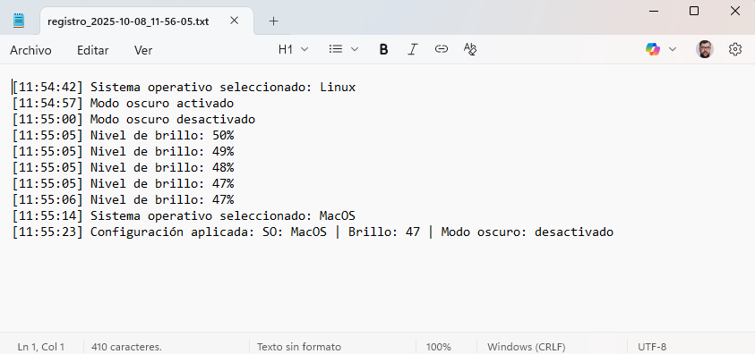

# Tema 5. Explotación de componentes visuales

**Proyecto: “Panel de control interactivo”.**

## 1. Introducción

En esta práctica vas a diseñar, programar y documentar una aplicación gráfica en Java denominada **“Panel de control interactivo”**.
Su finalidad es poner en práctica los contenidos vistos en el **Tema 5 – Explotación de componentes visuales**, especialmente:

* Detección y gestión de **eventos**.
* Uso de **listeners** para capturar interacciones del usuario.
* **Asociación de acciones** a los eventos generados.
* Creación y ejecución de **pruebas unitarias con JUnit**.
* **Documentación técnica y funcional** de la aplicación.

El objetivo final es que domines la lógica de la programación orientada a eventos y comprendas cómo los componentes visuales responden a las acciones del usuario.

Además de desarrollar el código, tendrás que **documentar tu proceso**, describiendo con tus propias palabras cómo has trabajado, los problemas encontrados y las decisiones que has tomado.
No se evaluará solo el resultado final, sino también el proceso de desarrollo y tu capacidad para explicarlo.

## 2. Objetivos de aprendizaje

Al finalizar esta práctica, deberás ser capaz de:

* Crear interfaces gráficas con componentes visuales de Java Swing.
* Detectar y gestionar eventos mediante diferentes tipos de listeners.
* Implementar métodos que respondan a las acciones del usuario.
* Desarrollar y ejecutar pruebas unitarias con JUnit.
* Documentar correctamente una aplicación desde el punto de vista técnico y funcional.

## 3. Descripción general del proyecto

El **Panel de control interactivo** es una pequeña aplicación que simula una consola de configuración del sistema.
El usuario podrá elegir un sistema operativo, ajustar el nivel de brillo, activar el modo oscuro y aplicar los cambios.
La aplicación mostrará información dinámica en función de las acciones del usuario y permitirá comprobar el correcto funcionamiento de algunos métodos mediante pruebas unitarias.

## 4. Estructura de la práctica

La práctica se divide en **cinco ejercicios secuenciales**, más una **fase final de documentación**.
Sigue el orden indicado y guarda capturas de pantalla de cada paso.

### EJERCICIO 1. Configuración inicial del entorno

1. Crea un nuevo proyecto Java en **Eclipse**.
2. Añade la librería **JUnit 5** al proyecto:

   * Click derecho sobre el proyecto → *Build Path* → *Add Libraries* → *JUnit 5*.
3. Crea una clase principal llamada `PanelControl.java` con un método `main()` que muestre una ventana vacía (`JFrame`) con el título “Panel de control interactivo”.

**En el documento a entregar:**

* Describe con tus palabras cómo añadiste la librería JUnit.
* Explica brevemente qué son las pruebas unitarias y por qué son útiles.
* Incluye una captura del proyecto creado y la ventana vacía.

### EJERCICIO 2. Diseño básico de la interfaz

Crea una interfaz con los siguientes componentes (usa diseño visual o código manual):

| Elemento              | Tipo de componente | Descripción                           |
| --------------------- | ------------------ | ------------------------------------- |
| Etiqueta              | `JLabel`           | “Sistema operativo activo”            |
| Selector              | `JComboBox`        | Opciones: “Windows”, “Linux”, “MacOS” |
| Control de brillo     | `JSlider`          | Valores de 0 a 100                    |
| Opción de modo oscuro | `JCheckBox`        | Texto: “Modo oscuro”                  |
| Botón de acción       | `JButton`          | Texto: “Aplicar configuración”        |
| Área de texto         | `JTextArea`        | Para mostrar mensajes del sistema     |

Organiza los componentes de forma clara y estética.
Configura un `JPanel` principal y define un color de fondo neutro.

*Ejemplo visual:*



**En el documento a entregar:**

* Inserta una captura de la interfaz.
* Explica brevemente por qué has elegido esa disposición.
* Indica qué eventos (clic, cambio, selección, etc.) crees que deberás capturar para cada componente.

---

### EJERCICIO 3. Gestión de eventos y listeners

Implementa la lógica de funcionamiento:

1. **Selección de sistema operativo:**

   * Al seleccionar un elemento del `JComboBox`, el área de texto mostrará:

     > “Sistema operativo seleccionado: [nombre]”.

2. **Control de brillo:**

   * Cada vez que el usuario cambie el valor del `JSlider`, se actualizará el texto:

     > “Nivel de brillo: [valor]%”.

3. **Modo oscuro:**

   * Al marcar el `JCheckBox`, el fondo del panel principal se volverá oscuro y el texto de la interfaz será claro.
   * Al desmarcarlo, volverá al modo claro.

4. **Botón “Aplicar configuración”:**

   * Al pulsarlo, se mostrará un resumen con todos los valores actuales.
   * Por ejemplo:

     > “SO: Linux | Brillo: 75 | Modo oscuro: activado”

💡 Utiliza los listeners adecuados (`ActionListener`, `ItemListener`, `ChangeListener`) y comenta tu código indicando el propósito de cada bloque.

*Ejemplo visual:*



**En el documento a entregar:**

* Copia dos o tres fragmentos de código con comentarios explicativos.
* Añade capturas del resultado funcional.
* Explica qué tipo de listener has usado y qué método se ejecuta en cada caso.

---

### EJERCICIO 4. Pruebas unitarias con JUnit

Crea una clase `Configuracion.java` con el siguiente contenido:

```java
public class Configuracion {
    private String sistemaOperativo;
    private int brillo;
    private boolean modoOscuro;

    public Configuracion(String sistemaOperativo, int brillo, boolean modoOscuro) {
        this.sistemaOperativo = sistemaOperativo;
        this.brillo = brillo;
        this.modoOscuro = modoOscuro;
    }

    public boolean esModoLectura() {
        return brillo < 40 && modoOscuro;
    }

    public String resumen() {
        return "SO: " + sistemaOperativo + " | Brillo: " + brillo + " | Oscuro: " + modoOscuro;
    }
}
```

Después, crea una clase `TestConfiguracion.java` para comprobar:

* Que el método `esModoLectura()` devuelve `true` cuando el brillo es menor de 40 y el modo oscuro está activado.
* Que el método `resumen()` genera correctamente la cadena esperada.

Ejemplo de método de prueba:

```java
@Test
void testModoLectura() {
    Configuracion cfg = new Configuracion("Linux", 20, true);
    assertTrue(cfg.esModoLectura());
}
```

*Ejemplo visual:*


**En el documento a entregar:**

* Explica en qué consiste una prueba unitaria.
* Muestra tus métodos de prueba con comentarios.
* Incluye una captura de la ventana de resultados de JUnit (verde).


### EJERCICIO 5. Extensión funcional: registro de eventos y estadísticas

Amplía tu aplicación con un nuevo **panel de registro** que muestre un histórico de acciones del usuario.

1. Crea un `JTextArea` adicional llamado “Registro de actividad”.
2. Cada vez que ocurra un evento (selección, cambio de brillo, aplicación de configuración, etc.), añade una línea al registro con la hora y la descripción del evento.
   Ejemplo:

   > [10:42:13] Brillo cambiado a 75%
   > [10:42:19] Sistema operativo: Windows
3. Añade un botón **“Exportar registro”** que permita guardar el contenido del registro en un archivo `.txt` dentro del proyecto.

   * Puedes usar `FileWriter` o `BufferedWriter`.
   * El nombre del archivo debe incluir la fecha actual (por ejemplo, `registro_2025-10-08.txt`).
4. Incluye un pequeño método adicional de utilidad en la clase `Configuracion`, que cuente cuántas acciones se han realizado.
   Luego, añade una prueba unitaria para comprobar que el contador funciona correctamente.

*Ejemplo visual*






**En el documento a entregar:**

* Explica con tus palabras cómo implementaste la escritura en archivo.
* Añade una captura del archivo de texto generado.
* Comenta qué dificultades técnicas encontraste y cómo las resolviste.

### FASE FINAL: Documentación del proyecto

Redacta un pequeño informe técnico y reflexivo con los siguientes apartados:

1. **Introducción:** finalidad de la aplicación y resumen de las funciones implementadas.
2. **Capturas del funcionamiento:** muestra los distintos estados de la interfaz (antes y después de eventos).
3. **Descripción técnica:** explica la estructura de tus clases y cómo se comunican entre sí.
4. **Pruebas unitarias:** resumen de los casos probados y resultados.
5. **Reflexión personal:** qué has aprendido, qué te ha resultado más difícil y qué mejorarías.

---

## 5. Entrega

**Formato de entrega:** archivo `.zip` con:

* Carpeta del proyecto Java completo (⚠️**Importante** añadir tu nombre como comentario inicial en cada fichero java).
* Documento en formato PDF con tu informe y capturas.

**Nombre del archivo:**
`Apellido_Nombre_PracticaTema5.zip`

---

## 6. Criterios de evaluación

| Criterio                          | Descripción                                                        | Puntos |
| --------------------------------- | ------------------------------------------------------------------ | ----------- |
| Funcionalidad general             | La aplicación responde correctamente a todos los eventos.          | 3        |
| Uso adecuado de listeners         | Se emplean los tipos de listeners apropiados para cada componente. | 1.5        |
| Pruebas unitarias                 | Se implementan correctamente y se superan con éxito.               | 1.5        |
| Extensión funcional (Ejercicio 5) | Se añade el registro de eventos y exportación a archivo.           | 1.5        |
| Documentación propia y redacción  | Se explica el proceso, con claridad y en lenguaje personal.        | 1.5        |
| Estilo, diseño y presentación     | Interfaz cuidada, coherente y funcional.                           | 1        |

---

## 7. Recomendaciones

* Comenta todo el código con explicaciones breves y claras.
* Usa nombres de variables descriptivos.
* Guarda capturas frecuentes durante tu progreso.
* No copies código sin entenderlo: el objetivo es **demostrar tu autoría**.


