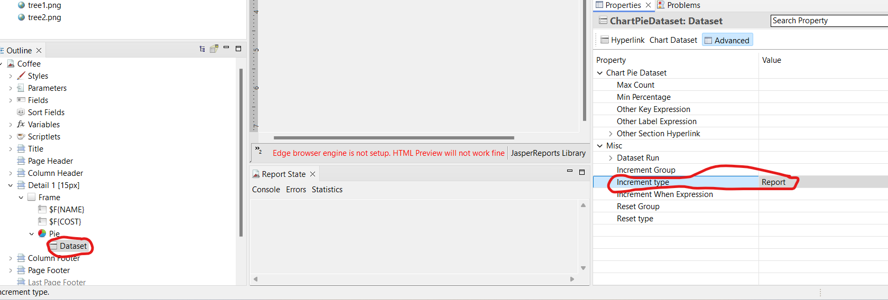

# Tema 9. Confección de informes II

**Tarea 1: "Informes avanzados: Parámetros, Gráficos y Subinformes".**

## 1. Introducción

En la unidad anterior aprendiste a crear informes estáticos básicos. En esta unidad (Tema 9), vamos a dar un salto cualitativo convirtiendo esos documentos en **herramientas de análisis dinámicas**.

Utilizando la misma base de datos de la **Biblioteca Municipal** que creaste en la tarea anterior, vas a desarrollar informes que interactúan con el usuario (pidiendo parámetros), muestran información visual compleja (gráficos) y estructuran datos jerárquicos (subinformes).

## 2. Objetivos de aprendizaje

Al finalizar esta tarea, deberás ser capaz de:

  * Configurar **parámetros de entrada** (`Parameters`) para filtrar consultas SQL dinámicamente.
  * Utilizar el **Editor de Expresiones** para lógica condicional compleja.
  * Insertar y configurar **imágenes estáticas y dinámicas** (rutas relativas).
  * Crear **gráficos estadísticos** (Charts) basados en los datos del informe.
  * Diseñar e implementar **subinformes** para mostrar relaciones maestro-detalle.

-----

## 3. Requisitos previos

Para realizar esta tarea **es imprescindible** que conserves la base de datos `biblioteca_municipal` creada en la Tarea 2 del Tema 8, con las tablas `socios`, `libros` y `prestamos` pobladas con datos.

Si perdiste la base de datos, deberás recrearla siguiendo las instrucciones del Ejercicio 1 de la Tarea 2 del Tema 8 antes de comenzar.

-----

## 4. Estructura de la tarea

La tarea se divide en **cuatro ejercicios** prácticos que cubren las funcionalidades avanzadas del Tema 9.

-----

### EJERCICIO 1. Informe parametrizado con imágenes condicionales

El director de la biblioteca necesita un informe que le permita buscar préstamos realizados en un **rango de fechas específico** y detectar visualmente aquellos que tuvieron una duración excesiva.

#### 1.1. Configuración de Parámetros

1.  Crea un nuevo informe llamado `Informe_Prestamos_Por_Fecha.jrxml` (plantilla Blank A4).
2.  En el panel `Outline`, busca la sección **Parameters**.
3.  Crea dos parámetros nuevos:
      * **Nombre:** `FechaInicio` | **Clase:** `java.sql.Date`
      * **Nombre:** `FechaFin` | **Clase:** `java.sql.Date`
4.  Configura la **Consulta SQL** (Dataset and Query Dialog) para usar estos parámetros. Deberás modificar la cláusula `WHERE` para filtrar por rango:

<!-- end list -->

```sql
SELECT 
    l.titulo, 
    s.nombre, 
    s.apellidos, 
    p.fecha_prestamo, 
    p.dias_prestamo
FROM prestamos p
INNER JOIN libros l ON p.id_libro = l.id_libro
INNER JOIN socios s ON p.id_socio = s.id_socio
WHERE p.fecha_prestamo BETWEEN $P{FechaInicio} AND $P{FechaFin}
ORDER BY p.fecha_prestamo ASC
```

#### 1.2. Diseño y Lógica Visual (Imágenes)

1.  Diseña una banda `Detail` simple con los campos obtenidos.

2.  Añade el **Logo de la biblioteca** en la banda `Title`.

      * Descarga cualquier icono de libro o biblioteca (formato PNG).
      * Usa el componente **Image** y selecciona la opción *Workspace resource* (importando la imagen a tu proyecto) para evitar rutas absolutas que fallen en otros ordenadores.

3.  **Imágenes condicionales (Alertas):**

      * Queremos que aparezca un icono de "Alerta" (un triángulo rojo o signo de exclamación) junto a los préstamos que hayan durado **más de 15 días**.
      * Busca o crea un icono pequeño de alerta (`alerta.png`).
      * Arrástralo a la banda `Detail`, a la derecha de los datos.
      * En las propiedades de la imagen, busca el campo **Print When Expression**.
      * Introduce la lógica para que solo se imprima si se supera el límite:

    <!-- end list -->

    ```java
    $F{dias_prestamo} > 15
    ```

**En el documento a entregar:**

  * Captura del **Dataset and Query Dialog** mostrando la consulta SQL con los parámetros.
  * Captura de la **vista previa (Preview)** donde se vea que el informe solicita las fechas antes de generarse.
  * Captura del informe generado donde se aprecien los **iconos de alerta** solo en las filas correspondientes.

-----

### EJERCICIO 2. Inclusión de gráficos estadísticos (Charts)

Vamos a añadir valor analítico al informe anterior incorporando un gráfico que resuma visualmente la duración de los préstamos en el periodo seleccionado.

#### 2.1. Configuración del gráfico

1.  En el mismo informe `Informe_Prestamos_Por_Fecha.jrxml`, ve a la banda **Summary**.
      * *Nota: Si la banda Summary no tiene altura, auméntala.*
2.  Arrastra el componente **Chart** desde la paleta.
3.  Selecciona un gráfico tipo **Pie Chart** (Gráfico Circular).
4.  El asistente te pedirá la configuración de datos (Dataset). Mantén el *Main Report Dataset* (usaremos los mismos datos que ya hemos filtrado por fechas).

#### 2.2. Configuración de las series

Queremos ver la proporción de préstamos "Cortos" vs "Largos". Como esto no es un campo directo de la BD, usaremos una expresión en la clave:

  * **Series (Key):** Define una expresión que agrupe los datos. Por ejemplo:
    ```java
    $F{dias_prestamo} <= 7 ? "Corto (1 semana)" : "Largo (+1 semana)"
    ```
  * **Value:** Simplemente cuenta los registros. Puedes poner un valor fijo `1`, y el gráfico sumará automáticamente cuántas veces aparece cada clave (Key).
  * **Label:** Puedes usar la misma expresión que en *Key* para que aparezca la etiqueta.


### Solución Alternativa: Creación del Gráfico mediante Variables de Conteo

Dado que el asistente automático genera errores de claves duplicadas ("Duplicate Key") al intentar agrupar los registros dinámicamente, utilizaremos un método más robusto: crear contadores manuales y pasar los totales finales al gráfico.

#### PASO 1. Crear las Variables de Conteo

En lugar de dejar que el gráfico cuente, crearemos dos variables que sumarán `1` cada vez que se cumpla la condición.

1.  En el panel **Outline**, haz clic derecho sobre **Variables** \> **Create Variable**.
2.  Crea la variable para préstamos cortos:
      * **Name:** `V_CORTOS`
      * **Value Class:** `java.lang.Integer`
      * **Calculation:** `Sum`
      * **Expression:**
        ```java
        $F{dias_prestamo} <= 7 ? 1 : 0
        ```
      * **Initial Value Expression:** `0`
3.  Crea la variable para préstamos largos:
      * **Name:** `V_LARGOS`
      * **Value Class:** `java.lang.Integer`
      * **Calculation:** `Sum`
      * **Expression:**
        ```java
        $F{dias_prestamo} > 7 ? 1 : 0
        ```
      * **Initial Value Expression:** `0`

#### PASO 2. Configurar el Dataset del Gráfico

Ahora vincularemos estas variables al gráfico circular.

1.  Inserta el **Pie Chart** en la banda **Summary**.
2.  Haz doble clic para abrir **Chart Data**.
3.  **Importante:** Borra cualquier serie que aparezca en la lista para empezar de cero.
4.  Añade la **Primera Serie** (Cortos):
      * **Series / Key:** `"Corto (1 semana)"`
      * **Value:** `$V{V_CORTOS}`
      * **Label:** `"Corto (1 semana)"`
5.  Añade la **Segunda Serie** (Largos):
      * **Series / Key:** `"Largo (+1 semana)"`
      * **Value:** `$V{V_LARGOS}`
      * **Label:** `"Largo (+1 semana)"`

#### PASO 3. Ajustar el Tiempo de Evaluación

Para que el gráfico muestre los totales finales y no intente dibujarse antes de terminar de contar:

1.  Cierra el asistente de datos y selecciona el gráfico en el editor visual.
2.  Ve al panel de **Properties** (Propiedades).
3.  Busca la propiedad **Evaluation Time**.
4.  Cámbiala de "Now" a **Report**.
      * *Esto asegura que el gráfico espere a que todas las variables hayan terminado de sumar antes de renderizarse.*

#### PASO 4. IMPORTANTE!

Añade la siguiente configuración del DataSet:



#### 2.3. Personalización

  * Cambia el título del gráfico a "Distribución de préstamos por duración".
  * Ajusta el tamaño para que ocupe todo el ancho de la banda Summary.
  * Activa la opción de mostrar la **Leyenda**.

**En el documento a entregar:**

  * Captura de la ventana de **configuración del gráfico (Chart Wizard)**.
  * Captura del informe final (PDF) mostrando el listado de préstamos y, al final, el **gráfico circular generado**.

-----

### EJERCICIO 3. Creación de subinformes (Master-Detail)

Este es el ejercicio más complejo. Crearemos una "Ficha de Libro" donde, por cada libro, se muestre un subinforme con su historial completo de préstamos. Esto requiere **dos archivos .jrxml**.

#### 3.1. Crear el subinforme (detalle)

1.  Crea un nuevo reporte llamado `Subinforme_Historial_Libro.jrxml`.
2.  **Importante:** Elimina todas las bandas excepto `Detail`. Un subinforme destinado a ser una lista no suele necesitar márgenes ni títulos propios (los heredará o gestionará el padre).
3.  Crea un **Parámetro** llamado `ID_LIBRO_PARAM` (tipo Integer). Este será el "enlace" con el informe padre.
4.  Configura la SQL para buscar los préstamos de ESE libro específico:

<!-- end list -->

```sql
SELECT 
    s.nombre, 
    s.apellidos, 
    p.fecha_prestamo, 
    p.fecha_devolucion
FROM prestamos p
INNER JOIN socios s ON p.id_socio = s.id_socio
WHERE p.id_libro = $P{ID_LIBRO_PARAM}
ORDER BY p.fecha_prestamo DESC
```

5.  Diseña la banda `Detail` para que muestre los campos (Nombre Socio, Fecha Préstamo, Fecha Devolución) en una sola línea, con letra pequeña (ej. 8-9pt).
6.  Compila/Guarda el informe.

#### 3.2. Crear el informe maestro

1.  Crea un nuevo reporte llamado `Informe_Maestro_Libros.jrxml`.
2.  Su consulta SQL será un listado de libros:
    `SELECT id_libro, titulo, autor, categoria FROM libros ORDER BY titulo`
3.  Diseña la banda `Detail`:
      * Coloca el Título del libro (en grande y negrita) y el Autor.
      * Deja un espacio debajo de estos datos dentro de la misma banda Detail.
4.  **Insertar el subinforme:**
      * Arrastra el elemento **Subreport** desde la paleta al espacio libre de la banda `Detail`.
      * Selecciona "Select an existing report" y busca tu archivo `Subinforme_Historial_Libro.jrxml` (o el archivo `.jasper` compilado).
5.  **Vincular los informes (Paso Crítico):**
      * En las propiedades del Subreport, busca **Parameters**.
      * Pulsa `Edit Parameters`.
      * Añade uno nuevo:
          * **Name:** Escribe exactamente el nombre del parámetro del hijo: `ID_LIBRO_PARAM`.
          * **Expression:** Selecciona el campo del padre que contiene el valor: `$F{id_libro}`.
      * *Explicación:* Esto le dice a Jasper: "Por cada libro que imprimas en el maestro, ejecuta el subinforme pasándole el ID de ese libro".
6.  Configura la conexión del subinforme: asegúrate de seleccionar "Use same connection used to fill the master report" en las propiedades del subreport.

**En el documento a entregar:**

  * Captura del diseño del **Subinforme** (solo banda Detail).
  * Captura de la ventana de **vinculación de parámetros** (donde relacionas `$F{id_libro}` con `$P{ID_LIBRO_PARAM}`).
  * Captura del **informe final en PDF**, donde se vea una lista de libros y, debajo de cada uno, su historial de préstamos correspondiente.

-----

### EJERCICIO 4. Refinamiento visual y estilos condicionales

Para finalizar, aplicaremos estilos condicionales (`Styles`) para mejorar la legibilidad del **Subinforme** creado en el ejercicio anterior.

1.  Abre `Subinforme_Historial_Libro.jrxml`.
2.  En el panel `Outline`, haz clic derecho en **Styles** → `Create Style`. Nómbralo "EstiloDevolucion".
3.  Queremos resaltar los préstamos que **aún no han sido devueltos** (es decir, `fecha_devolucion` es `null`).
4.  Configura el estilo condicional:
      * Dentro del estilo creado, haz clic derecho → `Create Conditional Style`.
      * **Condition Expression:** `$F{fecha_devolucion} == null`
      * **Propiedades visuales:** Configura para que, si se cumple, el texto salga en color **Rojo** y en **Negrita**.
5.  Aplica este estilo a los campos de texto de la banda Detail del subinforme (selecciona los campos y en propiedades asigna `Style` → "EstiloDevolucion").

**En el documento a entregar:**

  * Captura de la configuración del **Estilo condicional**.
  * Captura del resultado final donde se vean préstamos pendientes en color rojo dentro del historial.

-----

## FASE FINAL: Documentación y Reflexión

Genera un documento PDF único que incluya:

1.  **Portada:** Nombre, apellidos, módulo y fecha.
2.  **Desarrollo:** Para cada ejercicio, incluye una breve explicación de los pasos seguidos y las **capturas de pantalla** solicitadas.
3.  **Reflexión personal (Importante):**
      * ¿Qué dificultad has encontrado al vincular el informe maestro con el subinforme?
      * ¿En qué situaciones reales crees que es útil usar parámetros de fecha en lugar de imprimir todos los datos?
      * Compara la dificultad de hacer gráficos en JasperReports vs Excel.

## 5. Entrega


  * Sube a la plataforma el documento **PDF** con la documentación.
